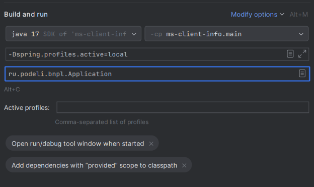

3\. Профили

В этом уроке мы поговорим о профилях, как передаются и используются секреты для старта приложений, а также как запустить несколько приложений на одном компьютере.

Представим ситуацию, что разработчик решил задачу и написал код. Стандартные пути для выкатки этой задачи на продуктовый сервер: 

1. Проверить работу локально (например, запустить приложение на своем компьютере и проверить работу endpoints).
1. Запустить тесты.
1. Выкатить задачу на какой-то стенд, например стенд с названием test, куда разработчики заливают все задачи для первоначального тестирования и отладки.
1. После проверки на test - сделать деплой на prod.
1. Чувствительные данные, вроде логина и пароля для БД, нужно уметь правильно хранить и прописывать в Spring (напрямую хранить нельзя).
1. В процессе разработки иногда важно уметь запустить веб приложение в нескольких экземплярах, например для тестирования.

Во всех случаях (локальное окружение, прогон тестов, test и prod стенды) нужны различные настройки: разные хосты и креды для подключения к БД, разные наименования хостов для каких-то внутренних интеграций(например, url для запросов в какой-то микросервис могут выглядеть по разному на dev и prod стенде). Чтобы не указывать каждый раз это вручную, такие настройки описываются где-то один раз для разных стендов (это и называется профили) и далее Spring можно запустить с указанием конкретного профиля (стенда), причем все настройки применятся автоматически.

Для того, чтобы в Spring указать конкретный профиль, нужно либо указать аннотацию @Profile, либо сделать отдельный файл application.properties/application.yaml. Обычно это делают, указывая название профиля после application через дефис: application-local.properties, application-dev.properties, application-prod.properties и т.д.

[Начало видео]
4\. Пример работы с профилями в Spring Boot

Давайте разберем, как работать с профилями на примере. За основу возьмем стандартный файл с настройками в Spring application.properties

1. **Создаем разные файлы настроек с разными профилями со следующим содержимым. Данные файлы обычно в той же директории, где находится стандартный application.properties:**

  **application.properties:** (файл настроек без профиля, по умолчанию)

  spring.application.name=demo-spring-profiles
  server.port=8080
  spring.datasource.url=${POSTGRES_URL:jdbc:postgresql://localhost:5432/test}
  spring.datasource.username=${POSTGRES_USERNAME:test}
  spring.datasource.password=${POSTGRES_PASSWORD:test}
  spring.datasource.driver-class-name=org.postgresql.Driver

  **application-local.properties:** (файл настроек без профиля для локального запуска)

  spring.application.name=demo-spring-profiles-local
  server.port=8081

  **application-test.properties:** (файл настроек без профиля для запуска на стенде test)

  spring.application.name=demo-spring-profiles-test
  server.port=8080

2. Теперь попробуем запустить приложение с разными профилями. Я, как разработчик, часто тестирую свои приложения с локальным профилем через создание файла application.yml (или application.properties) и указание профиля прямо из Idea: 

Профиль можно указывать по-разному, в том числе прописав профиль как аргумент (через вкладку Active profiles в Idea).
В результате spring приложение будет запущено с помощью аргумента: java.exe -Dspring.profiles.active=test, как это видно в тех же логах старта.
Точно также, кроме аргумента для профиля, можно передавать любые другие аргументы для запуска приложения напрямую через java, пример:
java -jar myapp.jar --server.port=9090

После того, как мы запустили приложение, в логах видно, что был выбрал профиль local, и приложение поднялось на 8081 порту.
При этом данные для подключения к БД взялись из application.properties, то есть по дефолту.
Это очень удобно, если нужно просто переопределить какие-то настройки.
Давайте попробуем запустить приложение с профилем test.
Видно, что приложение уже поднялось на 8080 порту, а не на 8081. То есть настройки взялись из application-test.properties.

3. **При старте Spring Boot сам подхватывает нужные настройки:**
- Если активен профиль local, будут применены настройки из application-local.properties.
- Если активен профиль test или какой-то другой, будут применены настройки из application-test.properties и так далее.

Итого, профили позволяют легко переключаться между разными конфигурациями без изменения основного кода приложения. Это очень сильно упрощает разработку - от локальной проверки, до запуска приложения на проде.

4. **Давайте также попробуем использовать аннотацию @Profile в коде.**
Представим ситуацию, что нам необходимо, чтобы какой-то бин создавался только на определенном стенде, например, test.
И нужно это для этого, чтобы отладить поведение программы.
Для этого напишем сервис TestOnlyService и пометим его аннотацией @Profile("test").

@Service
@Profile("test")
public class TestOnlyService {

    // Этот бин будет создан только если активен профиль test
    public TestOnlyService() {
        Logger log = LoggerFactory.getLogger(this.getClass());
        log.warn("TestOnlyService created! Profile 'test' is active.");
    }
}

Запустим приложение с профилем test. В логах мы видим эту надпись, значит бин создался.
Если исправить профиль с test на local, то бин не создался.
Давайте запустим и убедимся в этом.

6. Как передавать параметры и хранить секреты

В реальных приложениях часто возникает необходимость хранить чувствительные данные (секреты): пароли, токены, ключи доступа к сервисам и т.д. Хранить такие данные прямо в файлах application.properties или application.yml не рекомендуется, особенно если проект хранится в системе контроля версий (например, на GitHub).

**Поэтому есть следущюие рекомендации по хранению секретов:**
- Использовать переменные окружения для передачи секретов. Например, можно передавать пароль через переменную окружения:
- В файле application.properties обычно пишутся плейсхолдеры, например для пароля POSTGRES_PASSWORD:
  - `spring.datasource.password=${POSTGRES_PASSWORD}`
- Само значение для этой переменной окружения как правило хранится в специальных сервисах хранения секретов, например, HashiCorp Vault, AWS Secrets Manager и др.
- При старте приложения (например, в кубере или в какой-то еще системе для развертывания приложений) значение для POSTGRES_PASSWORD берется из системы хранения (например, Vault), задается как переменная окружения (для linux один из вариантов задать переменную окружения - использовать команду типа export POSTGRES_PASSWORD=секретный_пароль) и подставляется в ${POSTGRES_PASSWORD} в Spring.
Spring стартует с нужным паролем.
Если нужно задать какую-то настройку по умолчанию, например:
spring.datasource.url=${POSTGRES_URL:jdbc:postgresql://localhost:5432/test}
то после названия переменной окружения после двоеточия идет значение по умолчанию, в данном случае jdbc:postgresql://localhost:5432/test.

7. Давайте теперь рассмотрим, как запустить несколько приложений на одном компьютере

Иногда требуется запустить несколько экземпляров одного приложения (или разные приложения) на одном компьютере. Обычно проблема возникает из-за конфликта портов (по умолчанию все Spring Boot приложения стартуют на 8080 порту).

Для этого у каждого приложения (или экземпляра) указываем свой порт:
  - В application.properties: `server.port=8081`
  - Или через командную строку: `java -jar myapp.jar --server.port=8082`
- Можно создать отдельные профили для каждого экземпляра, где будет свой порт и другие настройки.
- Пример запуска двух приложений:
  - Первое: `java -jar myapp.jar --spring.profiles.active=loval --server.port=8081`
  - Второе: `java -jar myapp.jar --spring.profiles.active=test --server.port=8082`

Пример с запуском приложения на разных портах для разных профилей мы рассмотрели выше.

Итак, в этом видео мы познакомились с профилями в Spring, особенностями их запуска и для чего это нужно в реальной практике, а также разобрали особенности хранения секретов и их запуска, рассмотрели на практике как запускать несколько веб приложений на одном компьютере с разными портами.

До встречи.
